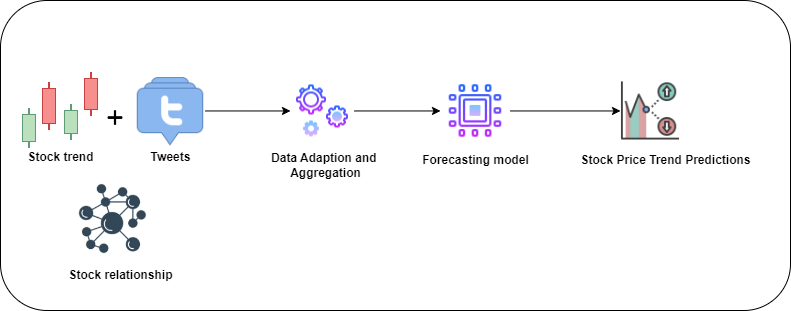

# Stock Trend Price Prediction
## Abstract
Stock trend forecasting is a fundamental task of quantitative investment where precise predictions of price trends are indispensable. There are many challenges of building a model that can be generalized and robust. With the stock market dynamically evolving, the distribution of future data can slightly or significantly differ from historical data - called distribution shift. Besides, most of previous works focus on tabular data structure, whereas the relationship among companies also affects the stock trends. In this work, we build a Graph model to capture the relations of companies that affect the stock prices. We aggregate the stock prices with the tweets that people share the information of the current financial situations and the stock market. To address the data shift in real life, we integrate the model with the data adaptor which helps to mitigate the effects of distribution shifts.
## Details

### Strategies
#### Graph structure and data aggregation
In the [paper](https://aclanthology.org/2020.emnlp-main.676/), they build a Company Correlation. For example, a company is a partner of other ones or a company is a parent of other ones. Graph model can capture the relations among companies that affects the stock trends. Besides, we combine the price data with text data to capture the current situation of the stock market to produce more robust predictions.
#### Data Adaption
To deal with distribution shift, we follow the idea of [DoubleAdapt](https://arxiv.org/abs/2306.09862). We transform the data into a generalized distribution. By doing this, we can know the partern and the distribution of the new data, so that we can mitigate the effect of distribution shift.
#### Aggregation model
Follow the algorithm in [paper](https://aclanthology.org/2020.emnlp-main.676/), we aggregate the prices within a window time - 7 days, to generate the feature for the day we predict the price trend. We use LRU model to aggregate all the prices, After that, we aggregate the texts as well. When we have the price embedding and the text embeding of each company, we combine these embeddings into one. Finally, we have the embedding for each company, then we feed these features with the graph structure to Graph model.
#### Graph Model
We implement Heterogenuous Graph Transformer Neural Network to aggregate the feature among companies. Then, the final embedding is fed into classification model.
### Dataset
Download the price and tweet dataset from this [repo](https://github.com/yumoxu/stocknet-dataset).

Follow this [repo](https://github.com/fulifeng/Temporal_Relational_Stock_Ranking) to generate graph.
### Training phase
```
python train.py
```
### Inference phase
```
python IL_main.py
```
## References
1. [Stock Dataset](https://github.com/yumoxu/stocknet-dataset)

2. [Deep Attentive Learning for Stock Movement Prediction From Social Media Text and Company Correlations](https://aclanthology.org/2020.emnlp-main.676/)

3. [DoubleAdapt: A Meta-learning Approach to Incremental Learning for Stock Trend Forecasting](https://arxiv.org/abs/2306.09862)